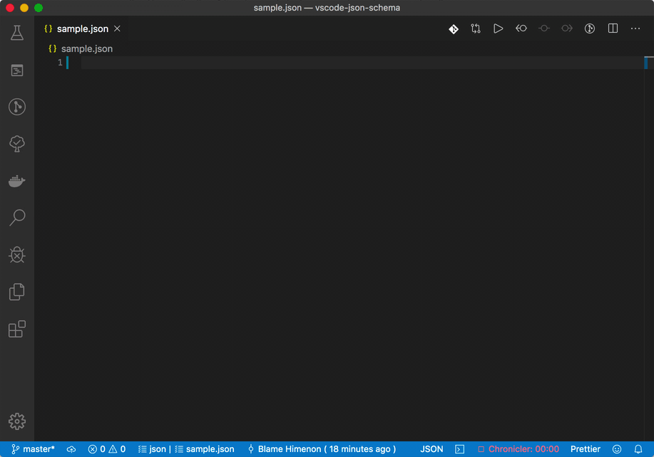

# vscode-json-schema

## DEMO



## Using

* Sample of https://code.visualstudio.com/docs/languages/json

```json
{
  "json.schemas": [
        {
            "fileMatch": [
                "sample.json"
            ],
            "url": "https://api.myjson.com/bins/uies4" // custom json schema url
        }
    ]
}
```

## JSON Hosting site

* http://myjson.com/

## LICENSE

MIT
